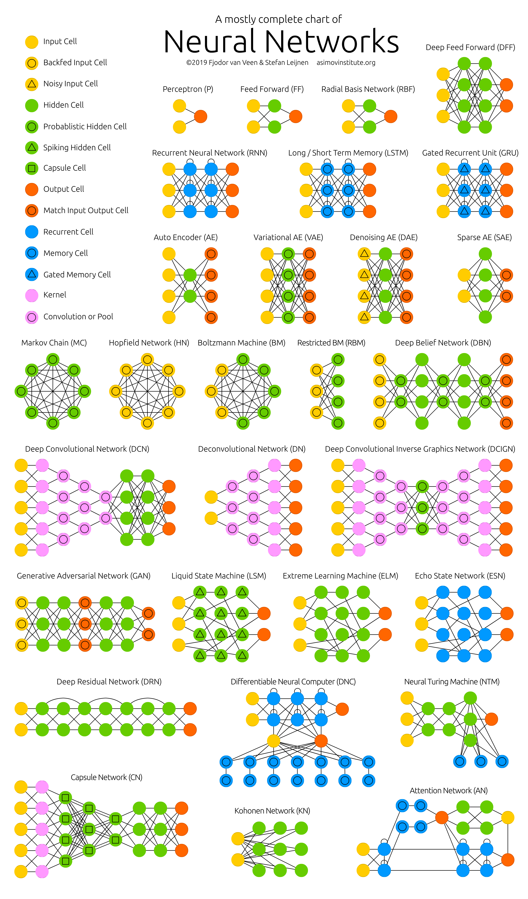
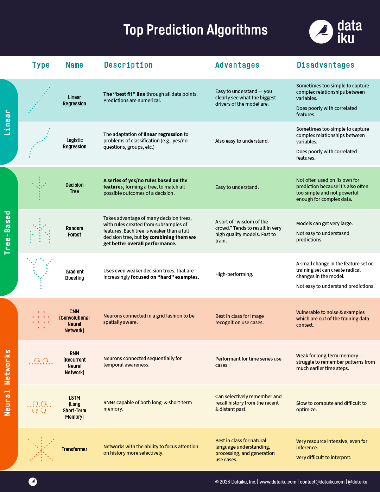

# Useful code for various python packages

- matplotlib
- pandas [in progress]
- numpy [in progress]
- scikit-learn
- math (linalg, prob and stats, calculus)

---

<!--  -->

Great lists of cheatsheets and resources:

- https://medium.com/machine-learning-in-practice/cheat-sheet-of-machine-learning-and-python-and-math-cheat-sheets-a4afe4e791b6
- https://medium.com/bitgrit-data-science-publication/a-roadmap-to-learn-ai-in-2024-cc30c6aa6e16
- https://github.com/jacobhilton/deep_learning_curriculum?tab=readme-ov-file

# reflection

3:16 (46 minutes in)

- finished first implementation of the autograd engine, passes test cases. need to run on nn next, then add vectorization and show it goes faster as a result (how to have a well-motivated hypothesis?)
- need to move ezgrad to datascience practice later
- make sure that i show copilot disabled before and after the interview (even though they didn't explicitly say i couldn't use it)

3:28 (back to work, 58 minutes in)

- to have a well-motivated hypothesis for vectorization, i need to first plot model training times at different sizes, and show how it increases with respect to the number of params. then give more evidence through a cprofile (do this later on)

4:35 (finished nn and hp tuning, 2 hours 5 minutes in)

- wasted way too much time on the hparam tuning, should have just called it quits half an hour ago. need to be more disciplined about this in the future

4:40 (back to work, 2 hours 10 minutes in. plan is to implement vectorization in 20 min and then clean up presentation after)
